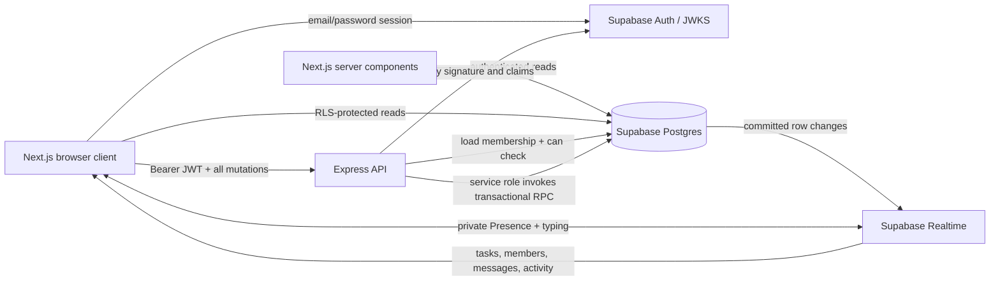

# Relay

Relay is a real-time project collaboration app for small teams. It combines a
permission-aware requirements board, live progress, project activity, chat,
online presence, and typing indicators in a dense Slack/Linear-inspired
workspace.

## Features

- Email/password registration, login, logout, and persistent Supabase sessions
- Project creation and keyboard project switching with `Ctrl/Cmd+K`
- Owner, Admin, Member, and Viewer roles enforced in both API and UI
- Three-column requirements board with accessible drag and drop
- Optimistic create, edit, move, and delete operations with rollback
- Live progress totals and per-member completion contributions
- Filterable activity feed with task deep links
- Paginated chat with grouped messages, typing, and scroll-aware autoscroll
- Online member indicators backed by private Supabase Presence
- System-aware light/dark mode with a persistent manual override
- Skeleton loading, retryable error states, keyboard shortcuts, and responsive
  layouts down to 768px

## Technology

| Area | Choice |
| --- | --- |
| Web | Next.js App Router, React, TypeScript, Zustand, dnd-kit, Lucide, Sonner |
| API | Node.js, Express, TypeScript, Zod, JOSE |
| Data/Auth | Hosted Supabase Postgres and Supabase Auth |
| Realtime | Postgres Changes, private Presence, and Broadcast |
| Repository | npm workspaces: `web`, `api`, and `shared` |
| Tests | Vitest and Supertest |

## Architecture and trust boundaries



The browser may read application tables directly using the anon key and user
JWT, but Row Level Security limits every row to project members. All project
mutations go through Express. The API verifies the JWT, reloads membership from
Postgres, applies the shared `can()` policy, and invokes service-role-only RPCs.
Each state-changing RPC commits its data change and activity entry together.

The service-role key must exist only in `api/.env`. Never prefix it with
`NEXT_PUBLIC_` or put it in the `web` workspace.

## Prerequisites

- Node.js 20 or newer
- npm
- A hosted Supabase project

Docker is not required. A project-local Supabase CLI is installed by
`npm install` for optional linked-project workflows.

## Clean-clone setup

### 1. Install dependencies

```powershell
npm install
```

### 2. Create and configure Supabase

Create a project at the Supabase dashboard. In **Authentication → URL
Configuration**, use:

- Site URL: `http://localhost:3000`
- Redirect URL: `http://localhost:3000/auth/callback`

In **SQL Editor → New query**, paste the complete contents of
[`supabase/setup.sql`](supabase/setup.sql) and run it once. The bundle contains
all ordered migrations and is intended for a new database.

Alternatively, deploy the migration directory with the local CLI:

```powershell
npm run supabase -- login
npm run supabase -- link --project-ref YOUR_PROJECT_REF
npm run supabase -- db push
```

### 3. Create local environment files

```powershell
Copy-Item web/.env.example web/.env.local
Copy-Item api/.env.example api/.env
```

Get the project URL and API keys from the Supabase project settings, then fill
the following values:

| File | Variable | Purpose |
| --- | --- | --- |
| `web/.env.local` | `NEXT_PUBLIC_SUPABASE_URL` | Hosted Supabase project URL |
| `web/.env.local` | `NEXT_PUBLIC_SUPABASE_ANON_KEY` | Browser-safe anon key; RLS still applies |
| `web/.env.local` | `NEXT_PUBLIC_API_URL` | Express URL, normally `http://localhost:4000` |
| `api/.env` | `SUPABASE_URL` | Same hosted project URL |
| `api/.env` | `SUPABASE_SERVICE_ROLE_KEY` | Backend-only service-role key |
| `api/.env` | `PORT` | API port, normally `4000` |
| `api/.env` | `WEB_ORIGIN` | Allowed browser origin, normally `http://localhost:3000` |
| `api/.env` | `SUPABASE_ANON_KEY` | Used only by `npm run verify:rls` |

Both local environment files are ignored by Git.

### 4. Seed the demo workspace

```powershell
npm run seed
```

The seed is idempotent and creates the demo users, project, memberships, tasks,
messages, and activity records.

### 5. Start Relay

```powershell
npm run dev
```

Open [http://localhost:3000](http://localhost:3000). The API health endpoint is
[http://localhost:4000/health](http://localhost:4000/health).

The Next.js development output is stored in `web/.next-dev`, separately from
the production `web/.next` output. This allows verification builds without
invalidating a running development server.

## Demo accounts

Every seeded account uses the password `Password123!`.

| Role | Email |
| --- | --- |
| Owner | `owner@relay.demo` |
| Admin | `admin@relay.demo` |
| Member | `member1@relay.demo` |
| Member | `member2@relay.demo` |
| Viewer | `viewer@relay.demo` |

## Database migrations

For a new project, run only `supabase/setup.sql`. For an existing database,
apply only migrations that have not already been run, in numeric order. Do not
rerun the setup bundle over an existing schema.

| Migration | Purpose |
| --- | --- |
| `0001_init.sql` | Enums, tables, indexes, profile trigger, progress views |
| `0002_rls.sql` | Membership helpers, RLS policies, table grants |
| `0003_mutations.sql` | Initial task and membership transaction functions |
| `0004_realtime.sql` | Realtime publication tables |
| `0005_projects_members.sql` | Project and role-management transaction functions |
| `0006_tasks.sql` | Complete task create, edit, move, and delete functions |
| `0007_messages.sql` | Atomic message and activity creation |
| `0008_realtime_authorization.sql` | Private Presence/Broadcast membership policies |

After adding or changing a migration, regenerate the clean-install bundle:

```powershell
npm run db:bundle
```

## Permission matrix

The pure policy function lives in `shared/src/permissions.ts` and is used by
both the Express routes and the interface.

| Action | Owner | Admin | Member | Viewer |
| --- | --- | --- | --- | --- |
| View project | Yes | Yes | Yes | Yes |
| Update project | Yes | Yes | No | No |
| Delete project | Yes | No | No | No |
| Invite member | Yes | Yes | No | No |
| Remove member | Yes | Member/Viewer only | No | No |
| Change role | Yes | Member/Viewer roles only | No | No |
| Create task | Yes | Yes | Yes | No |
| Edit task | Yes | Yes | Creator or assignee | No |
| Delete task | Yes | Yes | Creator only | No |
| Change task status | Yes | Yes | Yes | No |
| Post message | Yes | Yes | Yes | No |

A project must always have at least one Owner. The last Owner cannot be removed,
leave, or be demoted. Admins cannot modify Owner/Admin memberships or grant
Owner/Admin roles.

## Realtime event reference

| Source | Event | Client reaction |
| --- | --- | --- |
| `tasks` INSERT/UPDATE/DELETE | Task changed | Update board, progress, and contributions |
| `memberships` INSERT/UPDATE/DELETE | Membership changed | Update members, roles, and UI permissions |
| `messages` INSERT | New message | Append to chat, deduplicated by ID |
| `activity_log` INSERT | New activity | Prepend to the filtered activity feed |
| Presence sync/join/leave | Online users changed | Update sidebar and member online dots |
| Broadcast `typing` | Member is typing | Show typing text and clear it after three seconds |

On every Realtime subscription or reconnection, the client fetches the full
permission-checked project snapshot and replaces local state. If the current
membership is deleted, Relay clears access and redirects to the project list.

## Commands

| Command | Purpose |
| --- | --- |
| `npm run dev` | Build shared/API code and run API watchers plus Next.js |
| `npm run seed` | Idempotently populate the hosted demo workspace |
| `npm test` | Run shared permission and API route tests |
| `npm run typecheck` | Typecheck every workspace in strict mode |
| `npm run build` | Create production builds for all workspaces |
| `npm run check:web-secrets` | Scan the compiled web output for backend secrets |
| `npm run verify:rls` | Prove outsider reads are empty and direct writes fail |
| `npm run db:bundle` | Regenerate `supabase/setup.sql` from migrations |

## Verification

Run the automated checks:

```powershell
npm run typecheck
npm test
npm run build
npm run check:web-secrets
npm run verify:rls
```

`verify:rls` creates a temporary confirmed user who is not a project member,
checks that project, membership, task, message, and activity reads return zero
rows, verifies a direct task write is denied, and then removes the user.

For the live manual check, open the seeded Owner in one browser and Viewer in a
private window. Open the same project in both. Move a task as Owner and confirm
that the Viewer sees the board, progress, contributions, and activity update in
about a second. Confirm online dots and typing appear, chat messages stream, and
Viewer mutation controls remain disabled.

The concise presentation flow is in [`DEMO.md`](DEMO.md).
The exhaustive implemented-feature and interaction inventory is in
[`FEATURES.md`](FEATURES.md).

## Decisions and tradeoffs

- **Direct reads, API-only writes.** Direct Supabase reads reduce API plumbing
  and make Postgres Changes natural. RLS is therefore a hard security boundary;
  all writes remain centralized in Express for authorization and auditing.
- **JWKS token verification.** The API uses JOSE to verify issuer, audience,
  expiration, subject, and signature against Supabase JWKS. This supports key
  rotation without distributing the JWT signing secret.
- **Transactional RPC mutations.** Postgres functions keep each mutation and
  its activity record atomic. This is less database-agnostic than application
  transactions but prevents partially logged changes.
- **One shared permission function.** `can()` keeps API decisions and disabled
  UI states aligned. The API remains authoritative and never trusts client role
  claims.
- **Snapshot recovery plus event updates.** Zustand applies small deduplicated
  Realtime changes for responsiveness, then replaces state from a snapshot on
  reconnect to recover from missed events.
- **Fractional task positions.** Moving a card normally updates one numeric
  position instead of rewriting an entire column. Very long-lived boards would
  eventually benefit from background position compaction.
- **Hosted-first Supabase workflow.** `setup.sql` supports the requested
  Docker-free path, while ordered migrations and the local CLI preserve a
  repeatable deployment workflow.
- **Private ephemeral channels.** Presence and typing use membership policies
  on `realtime.messages`; durable project rows remain protected by their table
  RLS policies.

## What I would do with more time

- Add Playwright coverage for login, drag and drop, role changes, two-session
  Realtime synchronization, theme persistence, and keyboard flows.
- Run the RLS verifier and migration smoke tests in CI against an isolated
  Supabase project for every change.
- Replace the in-process chat rate limiter with a shared store for multi-instance
  API deployments.
- Add cursor pagination using `(created_at, id)` to handle messages with equal
  timestamps without ambiguity.
- Add position compaction and conflict instrumentation for heavily edited boards.
- Add structured logs, request IDs, error monitoring, and Realtime health
  metrics before production deployment.
- Perform a formal screen-reader and cross-browser accessibility audit.

## Security checklist

- RLS is enabled on every application table.
- Authenticated application tables expose SELECT policies only; browser writes
  are denied.
- Private Presence and Broadcast channels check project membership.
- Every project API mutation reloads membership and calls `can()`.
- Request bodies, parameters, and pagination inputs use shared Zod schemas.
- CORS is restricted to `WEB_ORIGIN` and Helmet secures API response headers.
- The service-role key is backend-only and checked against compiled web output.
